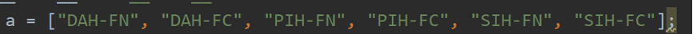
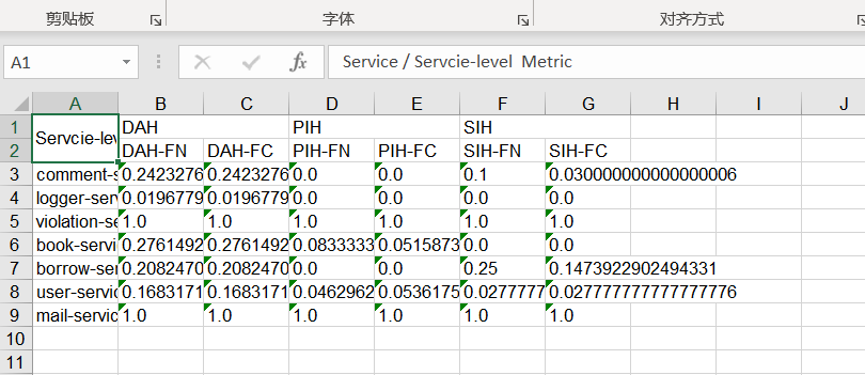
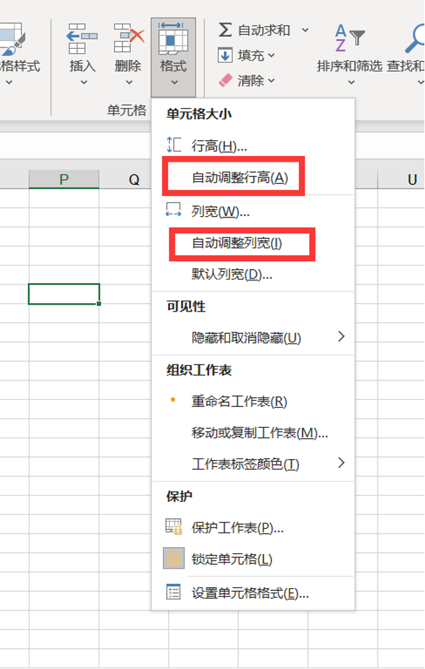

# Service-level metric transformer

HOW TO USE:

1. 按下图的顺序把数据粘贴到transfer.txt文件中（也可以只粘贴前几个，但是要按顺序，不能空缺）

2. 在config.ini中更改所转换格式项目的服务总数量

3. 将transfer.txt文档中的“服务 ”替换为“”，因为UTF-8不识别

4. 在第一组数据（i.e. DAH-FN）的最后一条数据后加一个“,”，方便数据格式统一处理

5. 运行service-level-transformer.py就可以得到数据表格（注意txt文件要与py文件在同一目录下）：

6. 在表格中选中需要区域，在开始->单元格->格式中点击自动设置行高和自动设置列高

