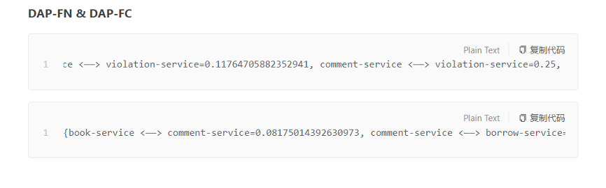
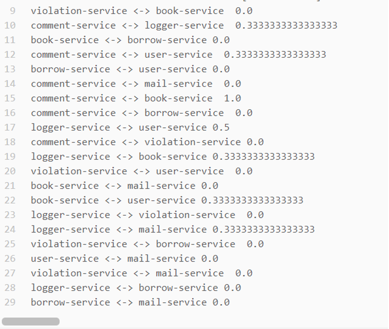
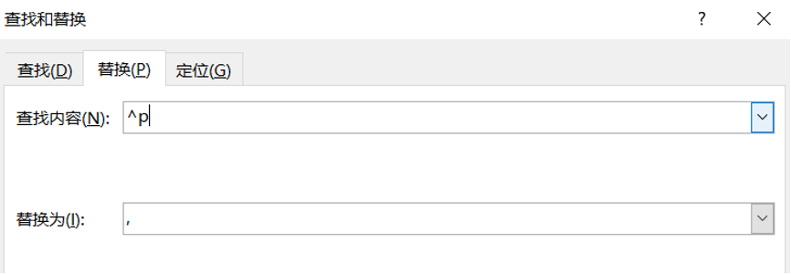
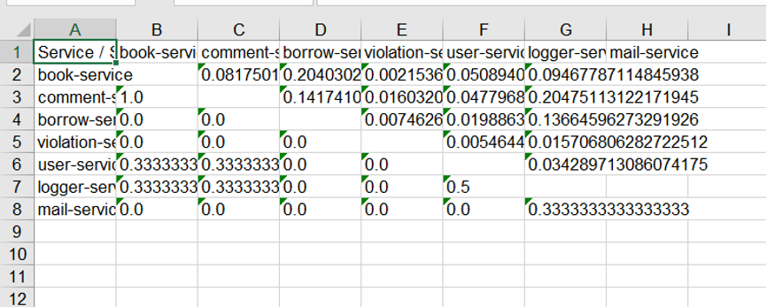

# Service-pair-level metric transformer

HOW TO USE:

1. 如果是这样的数据：

那么直接将两行粘贴到transfer2.txt即可直接运行程序得到表格test.xls（粘贴的时候前面是FN，后面是FC哦）

2. 但是如果是这样的数据：

那么将这一段粘贴到word文档中，使用ctrl+h，进行如下替换：

查找内容为^p，替换为逗号（英文的逗号），替换完后记得把最末尾的逗号删掉哦，然后再复制到transfer2.txt中，再运行程序即可

3. 得到表格如下：

在表格中选中需要区域，在开始->单元格->格式中点击自动设置行高和自动设置列高

 